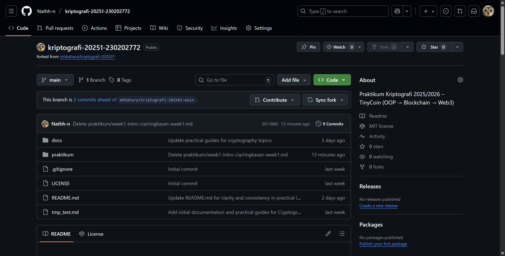

# Laporan Praktikum Kriptografi
Minggu ke-: 1
Topik: Pengenalan kriptografi  
Nama: Nur Fatahillah
NIM: 230202772  
Kelas: 5IKRB

# Tujuan
- ringkasan tentang sejarah kriptografi
- menjelaskan prinsip prinsip CIA
- penyimpulan peran kriptografi dalam sistem keamanan informasi modern.
- Menyiapkan repositori GitHub sebagai media kerja praktikum.

# Dasar Teori

Sejarah Kriptografi

Kriptografi merupakan ilmu dan seni untuk menjaga kerahasiaan pesan agar hanya pihak yang berhak yang dapat membacanya. Seiring perkembangan teknologi dan kebutuhan keamanan informasi, kriptografi telah berevolusi melalui tiga era besar: klasik, modern, dan kontemporer.

1. Era Kriptografi Klasik

Pada era ini, kriptografi digunakan untuk menyembunyikan pesan dalam bentuk teks sederhana. Metode yang digunakan masih berbasis penggantian (substitution) dan pergeseran (transposition) huruf. Contoh paling terkenal adalah Caesar Cipher, yang mengenkripsi pesan dengan cara menggeser huruf dalam alfabet sejumlah langkah tertentu. Misalnya, huruf A menjadi D jika digeser tiga langkah. Selain itu, ada pula Vigenère Cipher yang menggunakan kata kunci untuk mengatur pola pergeseran, membuatnya lebih sulit dipecahkan dibanding Caesar Cipher. Meski sederhana, algoritma klasik ini mudah dipecahkan dengan bantuan analisis frekuensi, sehingga tidak lagi dianggap aman di era digital.

2. Era Kriptografi Modern

Perkembangan komputer pada abad ke-20 membawa kriptografi ke tahap baru. Pada tahun 1976, Whitfield Diffie dan Martin Hellman memperkenalkan konsep kriptografi kunci publik (public-key cryptography), yang menjadi fondasi utama kriptografi modern. Salah satu algoritma paling terkenal adalah RSA (Rivest–Shamir–Adleman) yang menggunakan dua kunci berbeda untuk enkripsi dan dekripsi. Selain itu, AES (Advanced Encryption Standard) dikembangkan sebagai algoritma enkripsi simetris yang sangat aman dan efisien, banyak digunakan dalam komunikasi digital seperti jaringan internet, email, dan penyimpanan data.

3. Evolusi Menuju Kriptografi Kontemporer

Memasuki era digital dan desentralisasi data, kriptografi terus berevolusi menjadi bagian dari teknologi blockchain dan cryptocurrency. Dalam konteks ini, kriptografi tidak hanya digunakan untuk menjaga kerahasiaan, tetapi juga untuk menjamin integritas, keaslian, dan transparansi transaksi. Teknologi seperti SHA-256 (fungsi hash yang digunakan dalam Bitcoin) dan elliptic curve cryptography (ECC) digunakan untuk membuat sistem keuangan digital yang aman tanpa otoritas pusat. Kriptografi kontemporer berfokus pada keamanan data besar, komunikasi IoT, privasi pengguna, dan transaksi terdistribusi yang sulit dimanipulasi.

prinsip CIA

Konsep dasar Confidentiality, Integrity, dan Availability (CIA) merupakan tiga komponen utama dalam keamanan informasi yang saling melengkapi untuk menjaga data dan sistem tetap terlindungi serta dapat diandalkan. Confidentiality (kerahasiaan) berkaitan dengan upaya memastikan bahwa informasi hanya dapat diakses oleh pihak yang memiliki izin, sehingga privasi data tetap terjaga. Prinsip ini mencegah kebocoran atau akses tidak sah melalui mekanisme seperti penggunaan kata sandi, enkripsi, dan pengaturan hak akses. Integrity (integritas) menitikberatkan pada keaslian serta keutuhan informasi, yakni memastikan data tidak dimodifikasi, dirusak, atau diubah tanpa otorisasi. Dengan demikian, integritas menjamin akurasi serta konsistensi data, biasanya melalui penerapan hashing, tanda tangan digital, atau sistem audit untuk melacak perubahan. Sementara itu, Availability (ketersediaan) menegaskan pentingnya informasi dan sistem agar selalu dapat diakses oleh pengguna yang sah kapan pun diperlukan. Upaya ini dilakukan dengan menjaga keandalan sistem, melakukan pencadangan secara rutin, serta melindungi layanan dari gangguan seperti serangan DDoS. Secara keseluruhan, ketiga elemen CIA membentuk landasan yang kuat dalam menjaga keamanan informasi: kerahasiaan menjamin akses terbatas pada pihak berwenang, integritas memastikan data tetap benar dan utuh, sementara ketersediaan menjamin aksesibilitas informasi setiap saat. Oleh karena itu, CIA menjadi pilar fundamental dalam penerapan keamanan informasi di berbagai sektor, mulai dari komunikasi digital, perbankan, hingga sistem pemerintahan.

# Alat dan Bahan
- Vs Code
- Browser
- Terminal CMD
- Github dan git

# Langkah Percobaan
- Melakukan fork repository kriptografi
- Melakukan clone repository ke komputer lokal.
- Membuat folder praktikum/week1-intro-cia/ berisi laporan.md dan folder screenshots.
- Menulis ringkasan materi singkat.
- Menjawab quiz.

# Source Code
Belum ada sourcer code

# Hasil dan Pembahasan


# Jawaban Pertanyaan
1. Siapa tokoh yang dianggap sebagai bapak kriptografi modern?
2. Sebutkan algoritma kunci publik yang populer digunakan saat ini.
3. Apa perbedaan utama antara kriptografi klasik dan kriptografi modern?

1.Tokoh yang dianggap sebagai bapak kriptografi modern adalah Whitfield Diffie dan Martin Hellman.
Pada tahun 1976, mereka memperkenalkan konsep kriptografi kunci publik (public-key cryptography) melalui publikasi berjudul “New Directions in Cryptography”.
Konsep ini menjadi landasan utama bagi sistem keamanan digital modern, termasuk komunikasi terenkripsi di internet.

2.Beberapa algoritma kunci publik yang populer digunakan hingga saat ini antara lain:
- RSA (Rivest–Shamir–Adleman)
- ECC (Elliptic Curve Cryptography)
- DSA (Digital Signature Algorithm)
- Diffie–Hellman Key Exchange
Dari keempatnya, RSA dan ECC merupakan algoritma yang paling banyak digunakan dalam berbagai sistem keamanan digital seperti HTTPS, tanda tangan digital, dan enkripsi email.

3.Perbedaan utama antara kriptografi klasik dan kriptografi modern terletak pada media penggunaan, jenis kunci, serta tingkat keamanannya. Kriptografi klasik umumnya digunakan untuk teks biasa atau pesan manual dan hanya menggunakan satu kunci yang sama (simetris) untuk proses enkripsi maupun dekripsi. Contoh metode yang termasuk dalam kriptografi klasik adalah Caesar Cipher dan Vigenère Cipher.

Sementara itu, kriptografi modern diterapkan pada data digital dan sistem komputer, serta menggunakan dua kunci berbeda yaitu kunci publik dan kunci privat (asimetris). Algoritma yang umum digunakan dalam kriptografi modern antara lain RSA, AES, dan ECC. Dari segi keamanan, kriptografi klasik bergantung pada kerahasiaan algoritmanya sehingga relatif mudah dipecahkan oleh komputer modern. Sebaliknya, kriptografi modern mengandalkan kerahasiaan kunci serta kekuatan perhitungan matematis, menjadikannya lebih kuat dan banyak digunakan dalam sistem keamanan jaringan serta komunikasi digital saat ini.

# Kesimpulan
Perkembangan kriptografi bermula dari teknik klasik sederhana yang menggunakan metode substitusi, kemudian berevolusi menjadi pendekatan modern berbasis algoritma matematis seperti RSA dan AES. Saat ini, kriptografi juga diterapkan dalam teknologi mutakhir seperti blockchain. Prinsip utama keamanan informasi, yaitu CIA (Confidentiality, Integrity, Availability), menjadi dasar penting dalam setiap sistem digital agar data tetap terlindungi, dapat dipercaya, dan selalu dapat diakses saat dibutuhkan.

# Daftar Pustaka

## Commit Log
(Tuliskan bukti commit Git yang relevan.  
```
commit abc12345
Author: Nur Fatahillah <dneth001@gmail.com>
Date:   2025-09-20

    week2-cryptosystem: implementasi Caesar Cipher dan laporan )
```
